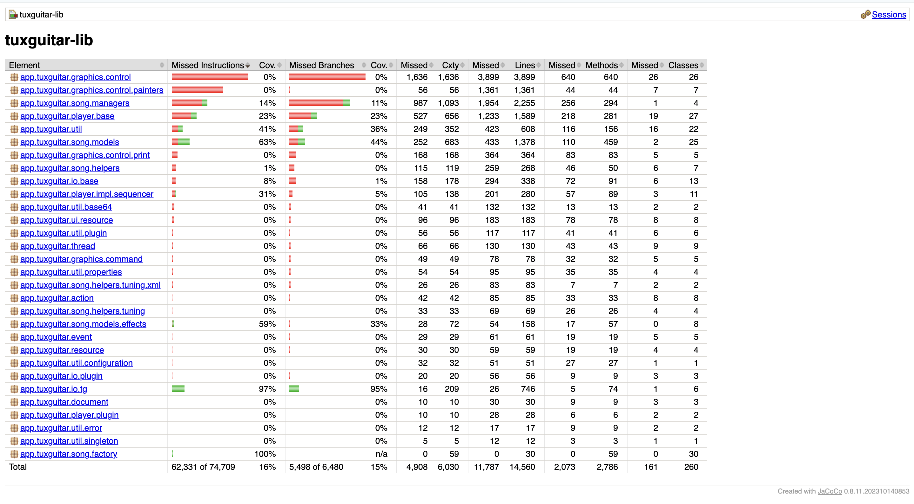
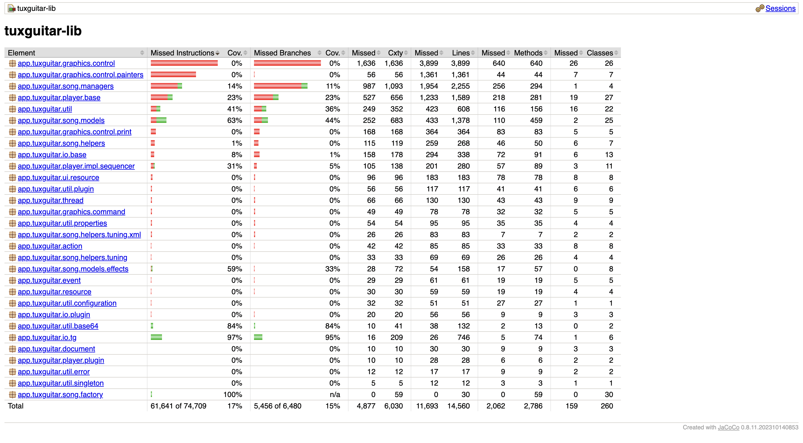

# Software Testing Report:  Part 3 White Box Testing and Coverage.
**Project:** TuxGuitar (Open Source Tablature Editor)  
**Course:** SWE 261P  
**Member:** Xiyao Li & Ping Lu  
**Date:** January 23, 2026
**Base repositoy link:** [Click](https://github.com/helge17/tuxguitar)
**Forked repositoy link:** [Click](https://github.com/lupingblaine/SWE-261P-tuxguitar)

## 1. Structural (White Box) Testing

### 1.1 What Structural Testing Is and Why It Matters
Structural (white box) testing designs test cases **from the internal code structure** rather than only from external requirements. It focuses on exercising control-flow elements such as statements, branches, and decision paths. This is important because:
* It reveals **unexecuted logic** that black-box tests may miss.
* It provides **quantitative evidence** of test thoroughness through coverage metrics.
* It helps target **high-risk or complex branches** where defects often hide.

### 1.2 Coverage Tool and Baseline (Before New Tests)
We ran JaCoCo on the existing test suite in `common/TuxGuitar-lib` and recorded baseline coverage.

**Command used:**
```bash
./mvnw -f common/TuxGuitar-lib/pom.xml \
  org.jacoco:jacoco-maven-plugin:0.8.11:prepare-agent \
  test \
  org.jacoco:jacoco-maven-plugin:0.8.11:report
```

**Coverage report location:**
`common/TuxGuitar-lib/target/site/jacoco/index.html`

**Baseline coverage (before adding any new tests):**
* **Line coverage:** 2,773 / 14,560 = **19.0%**
* **Branch coverage:** 982 / 6,480 = **15.2%**
* **Method coverage:** 713 / 2,786 = **25.6%**



### 1.3 Examples of Currently Uncovered Code
From the baseline report, several packages show **0% line/branch coverage**, indicating large untested areas:
* `app.tuxguitar.graphics.control` (0% line, 0% branch)
* `app.tuxguitar.graphics.control.painters` (0% line, 0% branch)
* `app.tuxguitar.graphics.control.print` (0% line, 0% branch)
* `app.tuxguitar.song.helpers` (1% line, 0% branch)
* `app.tuxguitar.io.base` (8% line, 1% branch)

These packages include rendering/painter logic, printing-related code, and helper utilities that are not currently exercised by the existing unit tests.

### 1.4 New Test Cases

**New test added:**  [Click]()
`common/TuxGuitar-lib/src/test/java/app/tuxguitar/util/base64/TestBase64Codec.java`

**Targeted production code:**  
`app.tuxguitar.util.base64.Base64Encoder`  
`app.tuxguitar.util.base64.Base64Decoder`

**What the new tests validate:**
* **Known Base64 encoding vectors:** We encode `""`, `"f"`, `"fo"`, `"foo"`, and `"foobar"` and compare against the standard Base64 outputs (`""`, `"Zg=="`, `"Zm8="`, `"Zm9v"`, `"Zm9vYmFy"`). This checks correct **padding rules** and the 3‑bytes‑to‑4‑chars encoding logic.
* **Known Base64 decoding vectors:** We decode the same Base64 strings and verify we get back the original text. This confirms correct handling of **no padding**, **single padding**, and **double padding** cases.
* **Ignored non‑Base64 characters:** We decode `"Zm9v\\nYmFy"` (Base64 with a newline inserted) and verify it becomes `"foobar"`. This confirms the decoder **skips non‑Base64 characters** like newlines or whitespace.
* **Binary round‑trip on raw bytes:** We encode and then decode a byte array containing edge values like `0`, `127`, and `-1`, and verify the bytes are identical. This ensures **non‑text binary data** is preserved without sign/byte loss.

**How to run the new test:**
```bash
./mvnw -f common/TuxGuitar-lib/pom.xml -Dtest=TestBase64Codec test
```

**After (JaCoCo re-run):**
* **Line coverage:** 2,867 / 14,560 = **19.7%** (↑ 94 lines)
* **Branch coverage:** 1,024 / 6,480 = **15.8%** (↑ 42 branches)
* **Method coverage:** 724 / 2,786 = **26.0%** (↑ 11 methods)


