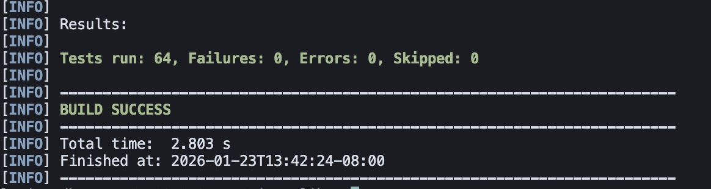
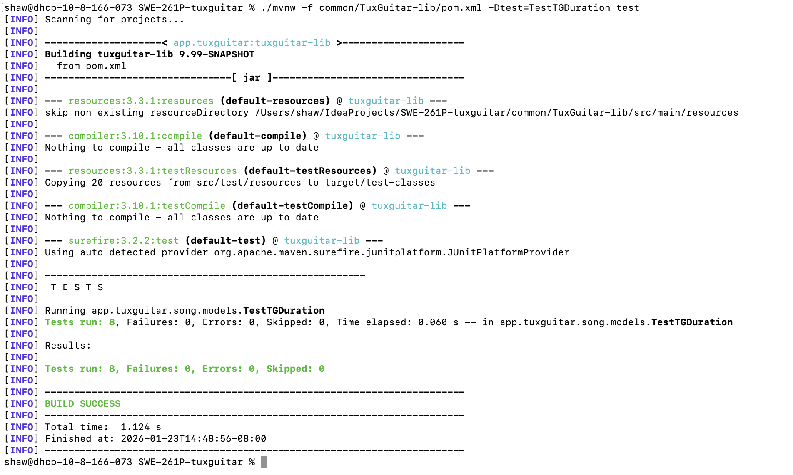
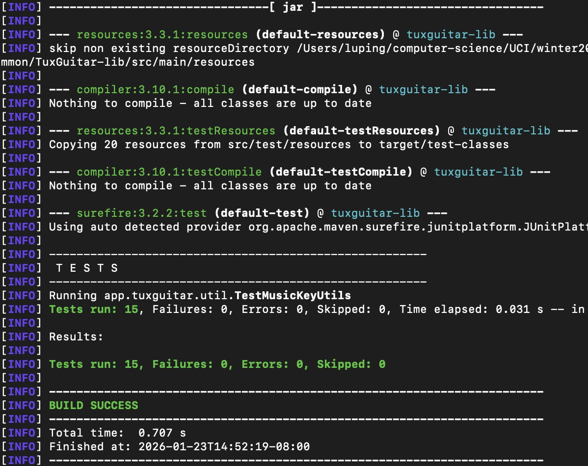
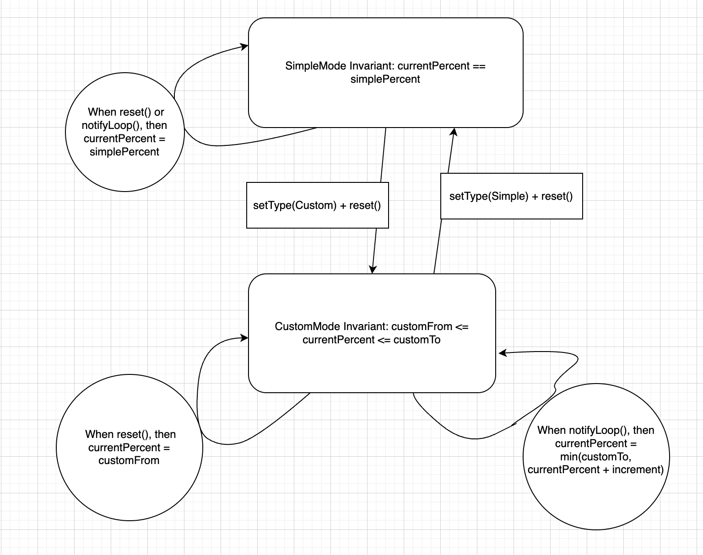
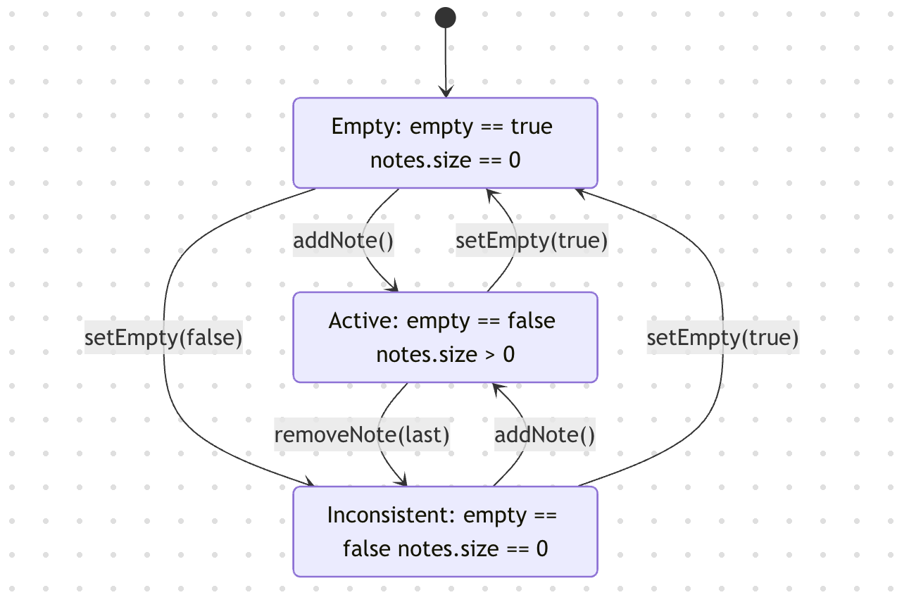
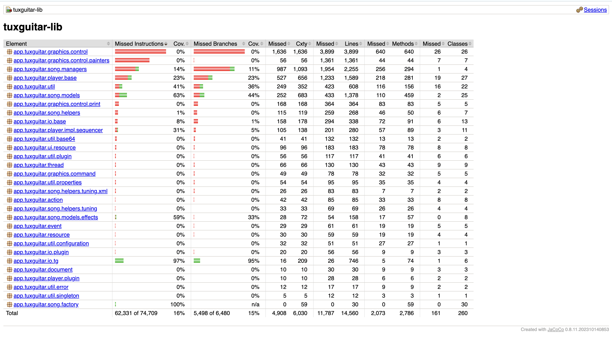
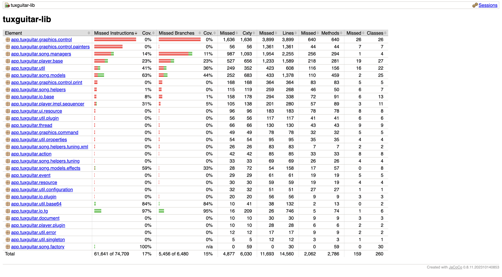

# Software Testing Report: Part 1 - Functional Partitioning
**Project:** TuxGuitar (Open Source Tablature Editor)  
**Course:** SWE 261P  
**Member:** Xiyao Li & Ping Lu  
**Date:** January 23, 2026

---

## 1. Introduction

### 1.1 Project Background
TuxGuitar is a widely adopted open-source application designed for creating, editing, and playing multi-track musical tablature. It functions as a versatile platform for music notation, compatible with numerous guitar score formats and offering both desktop and mobile interfaces. Its acceptance within the global music community is largely due to its cross-platform nature and robust handling of intricate musical compositions.

### 1.2 Technical Analysis and Scope
An examination of the project repository confirms that TuxGuitar qualifies as a substantial Java-based system, comfortably meeting the specified complexity thresholds:
* **Core Technology:** The application is developed chiefly in Java. The build incorporates the Standard Widget Toolkit (SWT) for the graphical user interface and allows for integration with optional native sound libraries such as FluidSynth or Jack for audio playback.
* **Codebase Volume:** The project contains roughly 266,800 lines of Java source code.
* **Architectural Complexity:** With a total of 2,658 distinct Java files, the system's scale significantly surpasses the baseline requirements of 15,000 lines of code and 100 classes.

---

## 2. Build and Environment Documentation

### 2.1 Prerequisites
To establish a functional build environment, the following dependencies must be configured:
* **JDK:** Version 9 or higher.
* **Build Tool:** Apache Maven 3.3 or higher.
* **GUI Library:** SWT 4.
* **Optional Components:** FluidSynth / Jack (for advanced audio features).

### 2.2 Compilation and Execution (macOS Example)
The following steps outline the procedure for building the project on a macOS environment:

1.  **Dependency Installation:** Install `openjdk`, `maven`, and `wget` via Homebrew:
    `brew install openjdk maven wget`
2.  **SWT Configuration:** Download the platform-specific SWT zip and install the `.jar` into the local Maven repository:
    ```bash
    TUX_ARCH=`uname -m | sed 's/arm64/aarch64/'`
    wget https://download.eclipse.org/eclipse/downloads/drops4/R-4.37-202509050730/swt-4.37-cocoa-macosx-${TUX_ARCH}.zip
    unzip swt-4.37-cocoa-macosx-${TUX_ARCH}.zip
    mvn install:install-file -Dfile=swt.jar -DgroupId=org.eclipse.swt -DartifactId=org.eclipse.swt.cocoa.macosx -Dpackaging=jar -Dversion=4.37
    ```
3.  **Core Build Execution:** Navigate to the build directory and execute the Maven lifecycle:
    ```bash
    cd desktop/build-scripts/tuxguitar-macosx-swt-cocoa
    mvn -e clean verify -P native-modules
    ```
4.  **Running the SUT:** Launch the generated `.app` located in the `target/` directory:
    `open desktop/build-scripts/tuxguitar-macosx-swt-cocoa/target/TuxGuitar.app`

---

## 3. Study of Existing Testing Practices

### 3.1 Testing Frameworks and Implementation
TuxGuitar utilizes **JUnit 5 (junit-jupiter-engine)** as its primary testing framework. The testing architecture follows a modular approach, where test suites are decentralized into individual component directories to ensure isolated verification of logic.

### 3.2 Key Testing Modules and File Locations
Based on our repository analysis, the existing test cases are primarily concentrated in the following core logic modules:
* **TuxGuitar-lib (`common/TuxGuitar-lib/src/test/java`)**: Houses critical music model tests, such as `TestTGDuration` and `TestTrackManager`.
* **Testing Resources**: The module utilizes dedicated resource files for file format verification, including `test_20.xml` and `test_midi_20.tg`.

### 3.3 Build Verification and Troubleshooting
During the initial execution of the test suite via Maven, we encountered a build hurdle that required technical intervention.

#### **Technical Challenge: Path Encoding Conflict**
When running `mvn test` within the `TuxGuitar-lib` module, the build initially failed with multiple `java.io.FileNotFoundException` errors.
* **Symptom**: The Maven Surefire plugin reported that it could not locate standardized music resource files (e.g., `Untitled_20.xml`).
* **Root Cause Analysis**: The local directory path contained special characters and spaces (`&`, `:`, and `%20`), which prevented the Java `FileInputStream` from correctly resolving absolute paths to the `target/test-classes/` directory.
* **Resolution**: We performed a "clean relocation" by moving the project to a standardized alphanumeric directory path. We then executed `mvn clean test` to purge corrupted build artifacts and re-index the resource metadata.

#### **Successful Test Execution**
After resolving the environment-specific pathing issues, we successfully executed the full test suite for the core library.



As shown in the execution log above, the system verified **64 test cases** with zero failures or errors, confirming the integrity of the core music engine, file I/O operations, and duration management logic.

---

## 4. Partitioning

### 4.1 Motivation and Concepts (Systematic Functional Testing & Partition Testing)
Because the input space of a real software system is vast, exhaustive testing is not feasible. **Systematic functional testing** addresses this by selecting representative inputs that reflect how the system should behave according to its specification. **Partition testing** divides the input space into subsets (partitions) that are expected to behave similarly; we then test one or more representative values from each partition, with extra attention to **boundary values** where failures are more likely. This provides high defect detection efficiency with a manageable number of test cases.

### 4.2.1: TGDuration (TestTGDuration.java)
**Feature chosen:** `TGDuration.splitPreciseDuration(total, max, factory)`  
This method is suitable for partitioning because the outcome depends on the relationship between the total duration and the maximum allowed duration, and whether the total can be expressed using valid note divisions (including dotted values).

**Partitioning scheme and partitions:**
- **P1 Valid, simple exact split:** Total duration can be evenly decomposed into identical pieces within the `max` limit.  
- **P2 Valid, fine subdivision required (boundary):** Total duration can be decomposed only using finer rhythmic divisions (e.g., dotted values).  
- **P3 Invalid / impossible to split:** Total duration cannot be expressed using allowed note values.  
- **P4 Valid with non‑power‑of‑two max (boundary):** `max` is a non‑power‑of‑two constraint; all pieces must be ≤ `max`.  
- **P5 Large input robustness:** Very large total duration to ensure no overflow or runtime failure.

**How partitions differ:**  
P1 is a straightforward exact split; P2 is valid but requires finer subdivisions; P3 is invalid and should return `null`; P4 stresses boundary behavior on `max`; P5 stresses robustness under large values.

**Relationship to existing tests:**  
The original `TestTGDuration` already covers core conversions, precise-time mapping, and several historical split cases. The five new tests are **additive**, and are designed specifically to exercise partition boundaries and invalid/robustness scenarios without modifying or replacing the original test logic.

**Representative values (one per partition):**
- **P1 - testSplitDurationValidSimple():** `total = WHOLE_PRECISE_DURATION / 2`, `max = WHOLE_PRECISE_DURATION / 8`  
- **P2 - testSplitDurationFineSubdivision():** `total = WHOLE_PRECISE_DURATION * 3 / 64`, `max = WHOLE_PRECISE_DURATION`  
- **P3 - testSplitDurationImpossibleReturnsNull():** `total = WHOLE_PRECISE_DURATION / 19`, `max = WHOLE_PRECISE_DURATION`  
- **P4 - testSplitDurationMaxBoundary():** `total = WHOLE_PRECISE_DURATION`, `max = WHOLE_PRECISE_DURATION * 3 / 8`  
- **P5 - testSplitDurationLargeTotalNoCrash():** `total = 5 * WHOLE_PRECISE_DURATION`, `max = 2 * WHOLE_PRECISE_DURATION`

**How representative values were chosen:**  
We selected values that map directly to each partition’s behavior, with explicit **boundary cases** (non‑power‑of‑two max and fine subdivisions) and an **invalid case** (non‑representable total).

**JUnit tests added:**  
`testSplitDurationValidSimple`, `testSplitDurationFineSubdivision`, `testSplitDurationImpossibleReturnsNull`, `testSplitDurationMaxBoundary`, `testSplitDurationLargeTotalNoCrash`

**How to run (command):**
```bash
cd /YourPathTo/SWE-261P-tuxguitar
./mvnw -f common/TuxGuitar-lib/pom.xml -Dtest=TestTGDuration test
```



### 4.2.2: Music Key Utilities (TestMusicKeyUtils.java)
**Feature chosen:** `TGMusicKeyUtils.noteName / noteFullName / sharpNoteFullName`  
This feature is suitable for partitioning because the output depends on **MIDI note range** and **key signature validity**, which define clear validity boundaries.

**Partitioning scheme and partitions:**
- **Q1 Valid MIDI range (boundary):** MIDI notes at the minimum and maximum valid values.  
- **Q2 Invalid MIDI range:** MIDI notes below minimum or above maximum should return `null`.  
- **Q3 Invalid key signature:** Key signature outside the valid range should return `null`.

**How partitions differ:**  
Q1 validates correct boundary behavior within the accepted range; Q2 validates input rejection for out‑of‑range notes; Q3 validates rejection for invalid key signatures.

**Relationship to existing tests:**  
The original `TestMusicKeyUtils` already verifies many note‑naming and accidental cases. The new tests are **additive**, focusing specifically on boundary and invalid‑input partitions (MIDI range and keySignature validity) without replacing existing coverage.

**Representative values (one per partition):**
- **Q1 - testNoteNameMidiRangeBoundaries():** `MIN_MIDI_NOTE = 12`, `MAX_MIDI_NOTE = 127`  
- **Q2 - testNoteNameInvalidMidiRangeReturnsNull():** `midiNote = 0`, `midiNote = 200`  
- **Q3 - testNoteNameInvalidKeySignatureReturnsNull():** `keySignature = -1`, `keySignature = 15`

**How representative values were chosen:**  
We used explicit boundary values for valid input and clearly invalid values to verify rejection logic.

**JUnit tests added:**  
`testNoteNameMidiRangeBoundaries`, `testNoteNameInvalidMidiRangeReturnsNull`, `testNoteNameInvalidKeySignatureReturnsNull`

**How to run (command):**
```bash
cd /YourPathTo/SWE-261P-tuxguitar
./mvnw -f common/TuxGuitar-lib/pom.xml -Dtest=TestMusicKeyUtils test
```



---

## 5. Functional Models (Finite State Machines) - Part 2. Functional Testing and Finite State Machines.

### 5.1 Why Finite Models Are Useful for Testing
Finite models (especially finite state machines) make behavior **explicit and enumerable**. By listing states and transitions, we can:
* Systematically cover **all valid transitions** and **self-loops**.
* Expose **illegal or missing transitions** (e.g., surprising states reachable by certain operations).
* Validate **sequences of operations**, not just single input/output pairs.
This yields higher confidence with a bounded set of tests.

### 5.2.1: `MidiPlayerMode` (Tempo Mode Progression)
**Feature chosen:** `app.tuxguitar.player.base.MidiPlayerMode`  
This component governs how playback tempo is computed across loops. Its behavior depends on the **mode** (`TYPE_SIMPLE` vs `TYPE_CUSTOM`) and the **currentPercent** value, making it well-suited to a finite state model.

**Finite state model (FSM):**
States are defined by `type` plus the invariant for `currentPercent`.


**How the model works:**  
`reset()` initializes `currentPercent` according to the mode.  
`notifyLoop()` is the loop-transition: in `SimpleMode` it remains constant, while in `CustomMode` it increments and caps at `customTo`.

**JUnit tests added (covering all transitions and self-loops):**
* `testDefaultSimpleResetSetsCurrentPercent`
* `testCustomResetStartsFromCustomFrom`
* `testCustomNotifyLoopIncrementsAndCaps`
* `testSimpleNotifyLoopResetsToSimplePercent`

**Test file:**  
`common/TuxGuitar-lib/src/test/java/app/tuxguitar/player/base/TestMidiPlayerMode.java`

**How to run:**
```bash
cd /YourPathTo/SWE-261P-tuxguitar
./mvnw -f common/TuxGuitar-lib/pom.xml -Dtest=TestMidiPlayerMode test
```

### 5.2.2: `TGVoice` (Voice Content State)
**Feature chosen:** `app.tuxguitar.song.models.TGVoice`  
`TGVoice` tracks musical content using two observable aspects: an `empty` flag and the `notes` list. The interactions between `addNote`, `removeNote`, and `setEmpty` create a **finite set of reachable states**, including an interesting “inconsistent” state that is reachable by design.

**Finite state model (FSM):**


**How the model works:**  
`addNote()` always sets `empty=false` and adds to the list.  
`removeNote()` does **not** flip `empty` back to `true`, so removing the last note creates state `[V2]`.  
`setEmpty(true)` clears the list and returns to `[V0]`.

**JUnit tests added (covering all states and transitions):**
* `testAddNoteTransitionsToActive`
* `testRemoveLastNoteLeavesInconsistentState`
* `testSetEmptyTrueClearsNotesAndSetsEmpty`
* `testSetEmptyFalseFromEmptyCreatesInconsistentState`

**Test file:**  
`common/TuxGuitar-lib/src/test/java/app/tuxguitar/song/models/TestTGVoiceStateMachine.java`

**How to run:**
```bash
cd /YourPathTo/SWE-261P-tuxguitar
./mvnw -f common/TuxGuitar-lib/pom.xml -Dtest=TestTGVoiceStateMachine test
```

---

## 6. Structural (White Box) Testing - Part 3 White Box Testing and Coverage.

### 6.1 What Structural Testing Is and Why It Matters
Structural (white box) testing designs test cases **from the internal code structure** rather than only from external requirements. It focuses on exercising control-flow elements such as statements, branches, and decision paths. This is important because:
* It reveals **unexecuted logic** that black-box tests may miss.
* It provides **quantitative evidence** of test thoroughness through coverage metrics.
* It helps target **high-risk or complex branches** where defects often hide.

### 6.2 Coverage Tool and Baseline (Before New Tests)
We ran JaCoCo on the existing test suite in `common/TuxGuitar-lib` and recorded baseline coverage.

**Command used:**
```bash
./mvnw -f common/TuxGuitar-lib/pom.xml \
  org.jacoco:jacoco-maven-plugin:0.8.11:prepare-agent \
  test \
  org.jacoco:jacoco-maven-plugin:0.8.11:report
```

**Coverage report location:**
`common/TuxGuitar-lib/target/site/jacoco/index.html`

**Baseline coverage (before adding any new tests):**
* **Line coverage:** 2,773 / 14,560 = **19.0%**
* **Branch coverage:** 982 / 6,480 = **15.2%**
* **Method coverage:** 713 / 2,786 = **25.6%**



### 6.3 Examples of Currently Uncovered Code
From the baseline report, several packages show **0% line/branch coverage**, indicating large untested areas:
* `app.tuxguitar.graphics.control` (0% line, 0% branch)
* `app.tuxguitar.graphics.control.painters` (0% line, 0% branch)
* `app.tuxguitar.graphics.control.print` (0% line, 0% branch)
* `app.tuxguitar.song.helpers` (1% line, 0% branch)
* `app.tuxguitar.io.base` (8% line, 1% branch)

These packages include rendering/painter logic, printing-related code, and helper utilities that are not currently exercised by the existing unit tests.

### 6.4 New Test Cases

**New test added:**  
`common/TuxGuitar-lib/src/test/java/app/tuxguitar/util/base64/TestBase64Codec.java`

**Targeted production code:**  
`app.tuxguitar.util.base64.Base64Encoder`  
`app.tuxguitar.util.base64.Base64Decoder`

**What the new tests validate:**
* **Known Base64 encoding vectors:** We encode `""`, `"f"`, `"fo"`, `"foo"`, and `"foobar"` and compare against the standard Base64 outputs (`""`, `"Zg=="`, `"Zm8="`, `"Zm9v"`, `"Zm9vYmFy"`). This checks correct **padding rules** and the 3‑bytes‑to‑4‑chars encoding logic.
* **Known Base64 decoding vectors:** We decode the same Base64 strings and verify we get back the original text. This confirms correct handling of **no padding**, **single padding**, and **double padding** cases.
* **Ignored non‑Base64 characters:** We decode `"Zm9v\\nYmFy"` (Base64 with a newline inserted) and verify it becomes `"foobar"`. This confirms the decoder **skips non‑Base64 characters** like newlines or whitespace.
* **Binary round‑trip on raw bytes:** We encode and then decode a byte array containing edge values like `0`, `127`, and `-1`, and verify the bytes are identical. This ensures **non‑text binary data** is preserved without sign/byte loss.

**How to run the new test:**
```bash
./mvnw -f common/TuxGuitar-lib/pom.xml -Dtest=TestBase64Codec test
```

**After (JaCoCo re-run):**
* **Line coverage:** 2,867 / 14,560 = **19.7%** (↑ 94 lines)
* **Branch coverage:** 1,024 / 6,480 = **15.8%** (↑ 42 branches)
* **Method coverage:** 724 / 2,786 = **26.0%** (↑ 11 methods)


