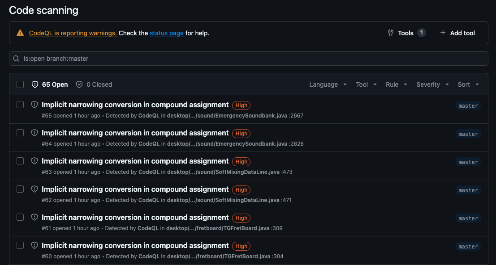
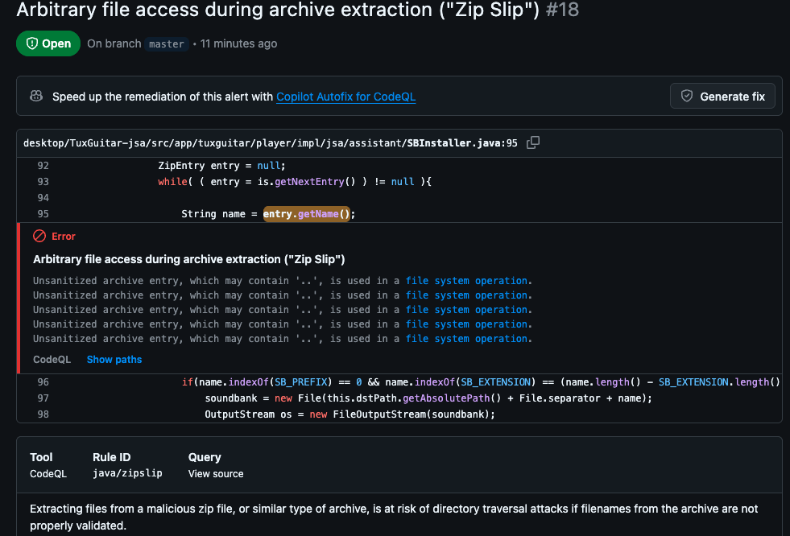
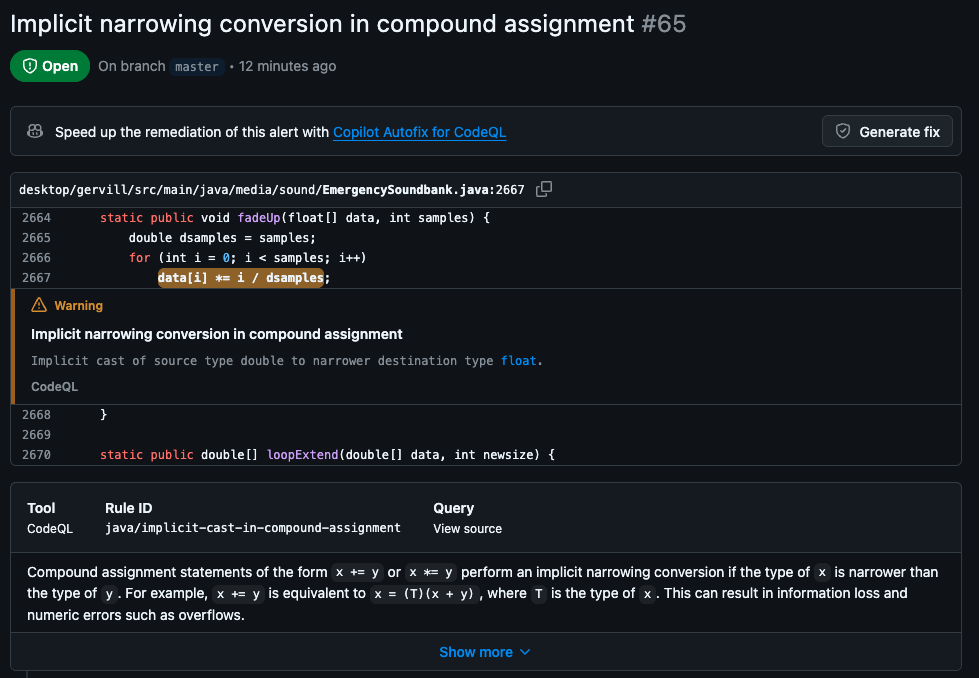
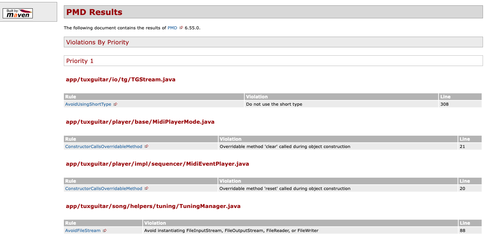
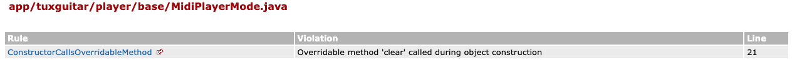
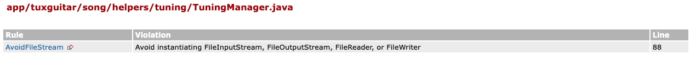

# Software Testing Report: Part 6 -- Static Analyzers

**Project:** TuxGuitar (Open Source Tablature Editor)\
**Course:** SWE 261P\
**Date:** March 03, 2026\
**Member:** Xiyao Li & Ping Lu  
**Base repository link:** [Click](https://github.com/helge17/tuxguitar)\
**Forked repository link:**
[Click](https://github.com/lupingblaine/SWE-261P-tuxguitar)

------------------------------------------------------------------------

# 1. Introduction to Static Analysis

## 1.1 Goals and Purpose of Static Analysis

Static analysis tools examine source code **without executing the
program**.\
Their primary goals are:

-   Detect potential bugs early\
-   Identify security vulnerabilities\
-   Improve code quality and maintainability\
-   Enforce coding standards\
-   Provide automated feedback during development

Unlike dynamic testing, static analyzers reason about control flow, data
flow, and structural patterns directly from the codebase. This enables
detection of:

-   Null dereference risks\
-   Resource leaks\
-   Unsafe file operations\
-   Poor object-oriented design patterns\
-   Performance anti-patterns

Static analysis is especially useful in Continuous Integration (CI)
environments because it provides early defect detection before runtime
failures occur.

------------------------------------------------------------------------

# 2. Tool 1 -- GitHub CodeQL (Code Scanning)

## 2.1 Tool Overview

GitHub CodeQL is a static analysis engine integrated with GitHub's
Security tab.

It performs:

-   Data-flow analysis\
-   Taint tracking\
-   Security vulnerability detection\
-   Semantic code reasoning

Official links:

-   CodeQL Documentation: https://codeql.github.com/\
-   GitHub Code Scanning:
    https://docs.github.com/en/code-security/code-scanning

CodeQL was enabled through GitHub Security → Code Scanning → Default
setup.

The workflow file generated:

    .github/workflows/codeql.yml

------------------------------------------------------------------------

## 2.2 CodeQL Overview Results

------------------------------------------------------------------------

## 2.3 CodeQL Warning Example 1 -- Zip Slip Vulnerability

**Rule ID:** java/zipslip\
**Description:** Arbitrary file access during archive extraction

CodeQL detected that unsanitized archive entry names may allow directory
traversal attacks (e.g., ../../). If an attacker crafts a malicious ZIP
file, files outside the intended extraction directory could be
overwritten.

This represents a genuine security vulnerability and demonstrates
CodeQL's strength in data-flow and filesystem risk analysis.

------------------------------------------------------------------------

## 2.4 CodeQL Warning Example 2 -- Implicit Narrowing Conversion

**Rule ID:** java/implicit-cast-in-compound-assignment

This warning indicates potential loss of precision due to implicit
casting from double to float.

Although not necessarily catastrophic, it may introduce subtle numeric
errors.

------------------------------------------------------------------------

# 3. Tool 2 -- PMD

## 3.1 Tool Overview

PMD is a static source-code analyzer focused on:

-   Code quality\
-   Best practices\
-   Performance anti-patterns\
-   Maintainability

Official link: https://pmd.github.io/

Integrated via Maven using:

    maven-pmd-plugin

Report generated with:

    mvn clean compile pmd:pmd
    mvn site

Report location:

    target/site/pmd.html

------------------------------------------------------------------------

## 3.2 PMD Overview Results

------------------------------------------------------------------------

## 3.3 PMD Warning Example 1 -- Constructor Calls Overridable Method

**Rule:** ConstructorCallsOverridableMethod

PMD detected that a constructor calls a method (clear) that can be
overridden by subclasses.

This creates a design risk because subclass behavior may execute before
object initialization completes, leading to inconsistent internal state.

------------------------------------------------------------------------

## 3.4 PMD Warning Example 2 -- AvoidFileStream

**Rule:** AvoidFileStream

PMD suggests avoiding direct instantiation of FileInputStream and
related classes.

This relates to resource handling best practices and encourages safer
API usage patterns.

------------------------------------------------------------------------

# 4. High-Level Comparison

## 4.1 Differences in Purpose

  Tool     Focus
  -------- --------------------------------------
  CodeQL   Security & data-flow vulnerabilities
  PMD      Code quality & maintainability

CodeQL performs deep semantic reasoning and vulnerability detection.\
PMD focuses on structural patterns and best practices.

------------------------------------------------------------------------

## 4.2 Overlap and Distinctions

The tools provide largely complementary information.

-   CodeQL identifies exploitable security flaws.\
-   PMD identifies structural design and maintainability issues.\
-   Minimal overlap in detected warnings.\
-   Each tool highlights distinct issue categories.

------------------------------------------------------------------------

## 4.3 Strengths and Weaknesses

### CodeQL Strengths

-   Advanced taint analysis\
-   Strong security focus\
-   GitHub CI integration

### CodeQL Weaknesses

-   More complex findings\
-   Steeper learning curve

### PMD Strengths

-   Easy Maven integration\
-   Clear HTML reports\
-   Effective for structural improvements

### PMD Weaknesses

-   Limited deep security reasoning\
-   More stylistic than semantic

------------------------------------------------------------------------

# 5. Conclusion

This project applied two static analyzers:

1.  GitHub CodeQL\
2.  PMD

CodeQL revealed security vulnerabilities such as archive traversal
risks.\
PMD exposed object-oriented design and resource management concerns.

Together, they provide complementary perspectives on software quality,
improving both security assurance and maintainability.

------------------------------------------------------------------------

**End of Part 6 Report**
