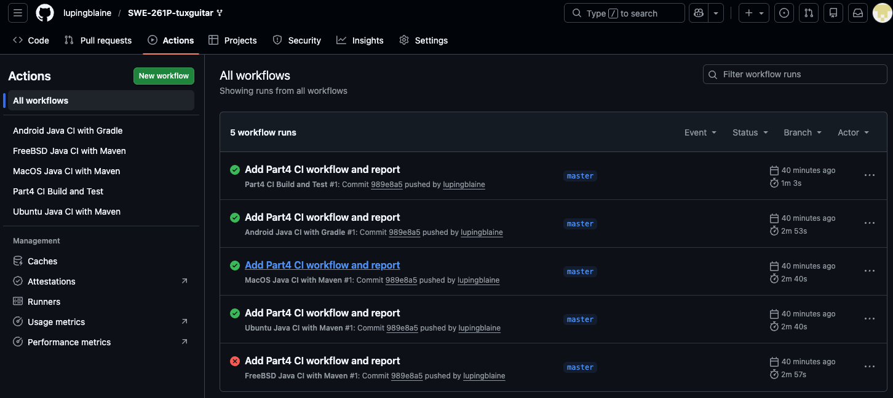
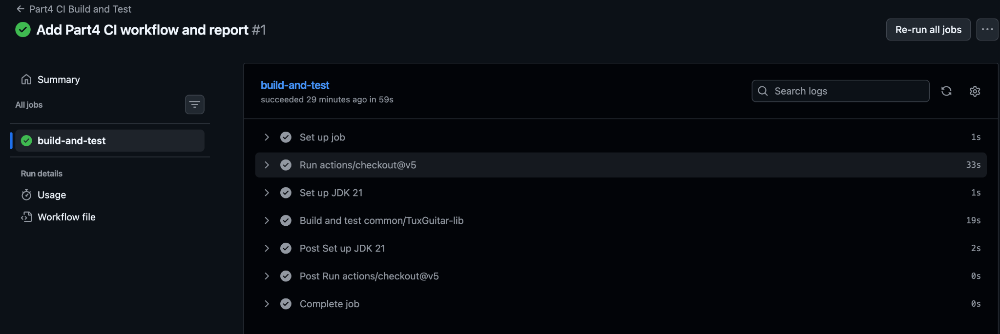
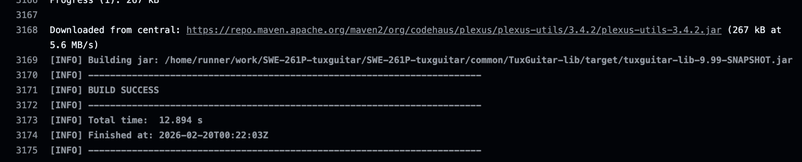

# Software Testing Report: Part 4 – Continuous Integration

**Project:** TuxGuitar (Open Source Tablature Editor)  
**Course:** SWE 261P  
**Member:** Xiyao Li & Ping Lu  
**Date:** February 20, 2026  

**Base repository link:** https://github.com/helge17/tuxguitar  
**Forked repository link:** https://github.com/lupingblaine/SWE-261P-tuxguitar  

---

## 1. Continuous Integration

### 1.1 What Continuous Integration Is and Why It Matters

Continuous Integration (CI) is a software development practice in which developers frequently integrate code changes into a shared repository. Each integration is automatically built and tested to ensure that the system remains correct and stable.

The primary purpose of CI is to:

- Detect integration errors early.  
- Provide immediate feedback when a commit breaks the build.  
- Automatically verify that test cases still pass.  
- Keep the main branch in a consistently buildable state.

By running automated builds and tests on every push or pull request, CI improves software reliability and reduces integration risk.

---

### 1.2 CI Platform Selection

For this project, we selected **GitHub Actions** as the CI platform.

Reasons:

- The repository is hosted on GitHub, enabling native integration.  
- Workflow configuration is stored inside the repository under `.github/workflows/`.  
- GitHub provides cloud runners and built-in Java/Maven support.  
- Results are automatically visible on each push and pull request.

---

## 2. CI Configuration

### 2.1 Workflow File

A new workflow file was created:

```
.github/workflows/part4-ci.yml
```

---

### 2.2 Workflow Behavior

The workflow builds and tests the core module:

```
common/TuxGuitar-lib
```

The workflow:

- Triggers on:
  - `push`
  - `pull_request`
  - `workflow_dispatch` (manual trigger)
- Checks out the repository.
- Sets up **Temurin JDK 21**.
- Enables Maven dependency caching.
- Executes the following Maven command:

```bash
./mvnw -f common/TuxGuitar-lib/pom.xml -e clean verify
```

The `verify` lifecycle performs:

- Compilation of production code  
- Compilation of test code  
- Execution of JUnit tests via Maven Surefire  
- Module verification  

---

### 2.3 Workflow YAML Configuration

```yaml
name: Part4 CI Build and Test

on:
  push:
  pull_request:
  workflow_dispatch:

jobs:
  build-and-test:
    runs-on: ubuntu-latest
    steps:
      - uses: actions/checkout@v5

      - name: Set up JDK 21
        uses: actions/setup-java@v5
        with:
          java-version: '21'
          distribution: 'temurin'
          cache: maven

      - name: Build and test common/TuxGuitar-lib
        run: ./mvnw -f common/TuxGuitar-lib/pom.xml -e clean verify
```

---

## 3. Build and Test Verification

After committing the workflow file and pushing the changes, GitHub Actions automatically triggered the CI pipeline.

---

### Figure 1 – GitHub Actions Workflow List



---

### Figure 2 – Job Execution Steps



---

### Figure 3 – Maven Build Success



---

### Figure 4 – Maven Test Summary


Observed result:

```
Tests run: 76, Failures: 0, Errors: 0, Skipped: 0
BUILD SUCCESS
```

---

## 4. Issues Encountered and Observations

- During the first run, Maven downloaded dependencies, which increased execution time. This is expected and improved in subsequent runs due to Maven caching.
- The repository contains other pre-existing workflows (such as FreeBSD Java CI with Maven). One of those workflows failed.
- However, this failure is unrelated to the newly created `Part4 CI Build and Test` workflow.
- The required CI workflow for this assignment runs on Ubuntu and completes successfully, fully satisfying the assignment requirements.

---

## 5. Summary

A GitHub Actions workflow was successfully created to implement Continuous Integration for the TuxGuitar project.

The workflow:

- Automatically triggers on push and pull request  
- Sets up a consistent Java environment  
- Builds the project  
- Runs all unit tests  
- Provides visible build and test results  

All test cases pass, and the system builds successfully under automated CI, fulfilling the Continuous Integration requirements for Part 4.
